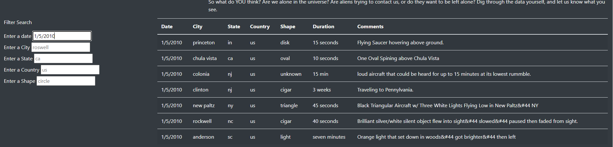
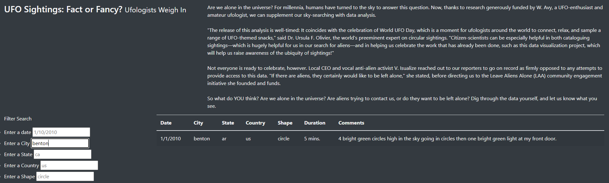
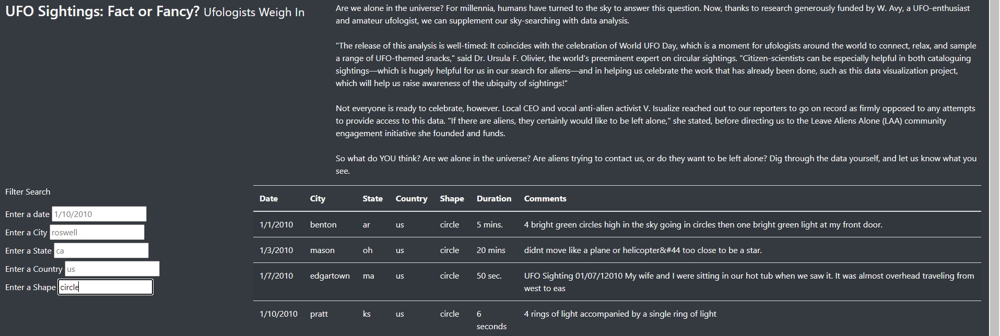
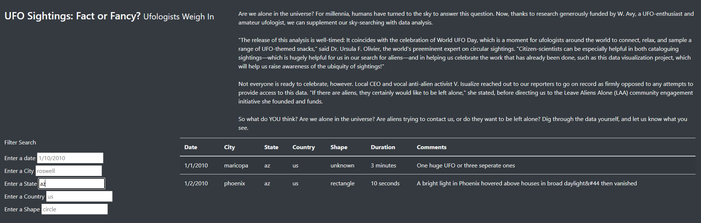
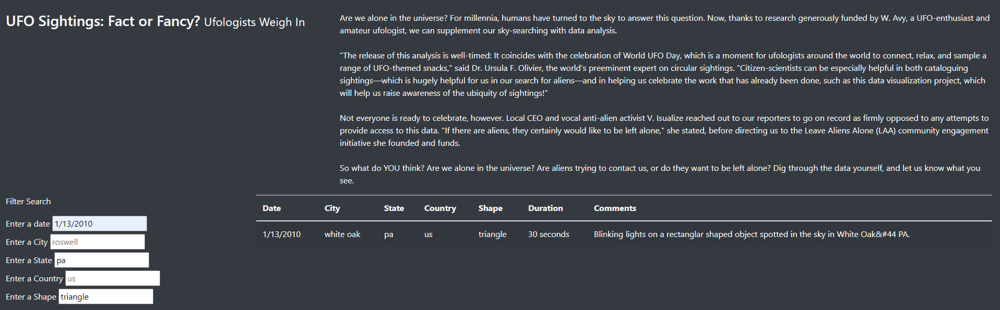

## **PROJECT OVERVIEW**
This project is about organizing the UFO sighting data and dispay it on a web page in a table form. The data is stored in JavaScript array and HTML, JS and Bootsrap are the main tools used in the project.

The table has been made dynamic by allowing the data to be filtered on different parameters like Date, city, state, country and shape of the UFO sighting.

## **RESULTS**

There are different parts of this web page including the table where the data of UFO sightings has been displayed. These are:

1- Navigation bar (UFO Sightings)- at top left corner

2- Heading of the page (The Truth is out there)

3- Information (UFO Sightings-Fact or Fancy)

4- Data Filtering Options- at center left of the page

5- UFO Sighting Table- center to bottom of the page

The items 2 and 3 are static meaning they dont change however items 1,4 and 5 are dynamic which means they can be changed with the user control. Here is the explanation of it.

## *Navigation Bar (UFO Sightings)*:

This bar is used to go back to the original form once the filter option is exercised. The user simply needs to hover the mouse at the bar and click it.

## *Data Filtering Options*

There are 5 data filtering options to filter the data on the basis of Date, city, state, country and shape of the UFO sighting. The user needs to enter the information on the white space against each filtering option and press "enter" or click anywhere on the page and the relevant information will be displayed in the table. For example, the result of filtering option for '1/5/2010' will give seven rows of data as shown in the below image:

Similarly User can filter the information by exercising any other filter or combination of filters as shown beloe:

### **Filter-city**

### **Filter_shape**

### **Filter_state**

### **Filter_multiple**

Another quality of the web page is the responsiveness to diffrent screen sizes like Laptop, Mobile phone, tablet etc as depicted in below image for mobile phone view:

## *Table*

Here the data is displayed for all the records but would show only the relevant information if the filtering options are exercised. 

## **SUMMARY**
Though the web page is dynamic and aesthatically pleasing but still there is a room for improvements. One major drawback is that the web page doesnt show who is the owner of the site or in case of any feedback from any user, who should be contacted and at which address. It doesn't show, who is uploading the content and why someone believe on this information?

From design perspective, one drawback is that it should show some visuals of UFO's to make it more relevant to the content.

### **ADDITIONAL RECOMMENDATIONS**

1- Under the filtering options, a drop down menu should be added to make it easier for the users

2- The Navigation Bar which takes the user to the original page should be placed nearer to the filtering options to make it more convenient.

3- The alignment of the table and the content should be better.

4- The table should be easily readable on the smaller screens.

